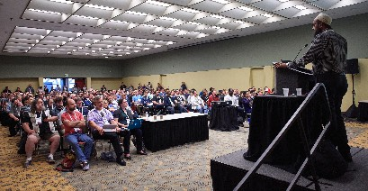

# Who is Hussain

*This is my MANAGER README. My personal readme is in a separate document for [quicker access](https://hussainweb.github.io/README/). It would help you to know me better as a manager if you first know me as a person, and I'd recommend you to read that first.*

## Table of Contents

- [Who is Hussain](#who-is-hussain)
  - [Table of Contents](#table-of-contents)
  - [Hussain, as a manager](#hussain-as-a-manager)
  - [My Values](#my-values)
    - [Enthusiasm](#enthusiasm)
    - [Openness](#openness)
    - [Competency](#competency)
    - [Curiosity](#curiosity)
    - [Humour](#humour)
    - [Trustworthiness](#trustworthiness)
  - [My expectations](#my-expectations)
  - [DRI model](#dri-model)
  - [Process and Software Development](#process-and-software-development)
    - [Clean Pull Requests (or Merge Requests)](#clean-pull-requests-or-merge-requests)
    - [Consistency](#consistency)
    - [Know your stuff](#know-your-stuff)
  - [What you may expect from me](#what-you-may-expect-from-me)
    - [Honesty](#honesty)
    - [Learning](#learning)
  - [My view on one-on-ones](#my-view-on-one-on-ones)
  - [My view on feedback](#my-view-on-feedback)

---

Hi, I am [**Hussain**](https://www.linkedin.com/in/hussainweb/), a **Service Area Lead** at [Axelerant](https://www.axelerant.com/) who is learning the ropes of working more and more with people rather than machines. I have built, and more importantly, helped others build several [Drupal solutions](https://www.drupal.org/u/hussainweb) over the past few years. I am an introvert pushing myself towards extroversion by speaking at conferences, organising meetups, and pushing myself to introduce myself to others at meetups and conferences. Read my [personal README](https://hussainweb.github.io/README/) to know more about me as a person.

## Hussain, as a manager

I'm looking forward to talking to you and know more about you. I have written this document to describe my working style, my values, and my motivations, so that we may have a more aligned and productive conversation.

I stress on learning fundamentals and theory but balanced with a healthy dose of pragmatism. I care about you as a person first and firmly believe that your well being comes before any work or cause. I try to be nice but not at the expense of being honest. I believe in giving feedback that needs to be heard rather than that which needs to be said. I think it is more important to be kind rather than being right.

## My Values

### Enthusiasm

I am deeply interested in doing the right thing, the right way. Of course, "right" is subjective and changes from time to time which is why I am also actively learning what the right thing might be at any time and what would be the right way to do that thing.

### Openness

I can't sugarcoat things I need to say. It's not that I don't, but I can't. Which means that I put in the extra effort to be nice. I work on the principle of being open and then kind. Usually, that happens at the same time but there are times when they don't.

### Competency

I believe you should do what you like to do. That is what makes you competent. If you are doing something you don't like to do and hence will never be competent in it, you're wasting your time, and others'.

### Curiosity

You can't be enthusiastic about learning if you are not curious.

### Humour

I believe in building trusting relationships. Humour is a quick way to get there.

### Trustworthiness

I constantly work to build trust. Mainly I do that by doing what I said I would do. I am not perfect but I do what I can.

## My expectations

My basic expectation from anyone on the team boils down to these things:

- Play for the team
- Always learn
- Do what you said you will
- Finally, take care of yourself

## DRI model

[**D**irectly **R**esponsible **I**ndividual](https://about.gitlab.com/handbook/people-group/directly-responsible-individuals/) is someone responsible for seeing a task or a project done. When I delegate, I prefer to assign the responsibility for decision making and success on the owner for that task. This doesn't mean I don't give feedback, but it means that the person has the freedom to meet the objectives of the task in the best way as long as it meets the conditions.

## Process and Software Development

We usually follow sprint or Kanban based development styles. You can read up on the specifics of these elsewhere (Google is a good place to start as any), but I'll share what I look for here.

### Clean Pull Requests (or Merge Requests)

Your PR should be complete, atomic, and clean. Keep PRs small so that they are easy to review. They should be as small as possible but not smaller. It should also pass any style and correctness checks.

### Consistency

Keep your code and system consistent. If you are naming fields or variables in one way, make sure you follow that in all places. Using camelCasing for parameters? Use that everywhere. It is best if you follow a team agreed code style.

### Know your stuff

Look at competency in my values list to understand more. I recognise you may be at a different stage in your learning but always keep learning from your mistakes, from feedback given to you, and from incidents caused unto you. And always be curious about how to do something better.

## What you may expect from me

### Honesty

Like I said before, I am kind but not at the expense of openness. I will tell you how you are doing in the best way I can. You can always ask me for feedback on specific or general things.

### Learning

If I feel that you could be learning more, I'll tell you to. I believe we learn every minute, even if we don't want to. I want to make it intentional and deliberate so that it helps you in your goals.

## My view on one-on-ones

I believe 1-on-1s are the most important tool for a manager and team member relationship. I try to keep any 1-on-1s predictable but driven by the team member. I am here to support your growth. I do that by helping you find alignment with the organisation so that growth is resonant and efficient.

## My view on feedback

Open, kind, right. That is the order of attributes I use to prepare feedback. I believe in continuous feedback delivered using the most appropriate means to cause the impact I desire in you. Further, my feedback is my own. It is *my* view of behaviours *I* noticed in you. If you think it is not justified, I would love to know why.
